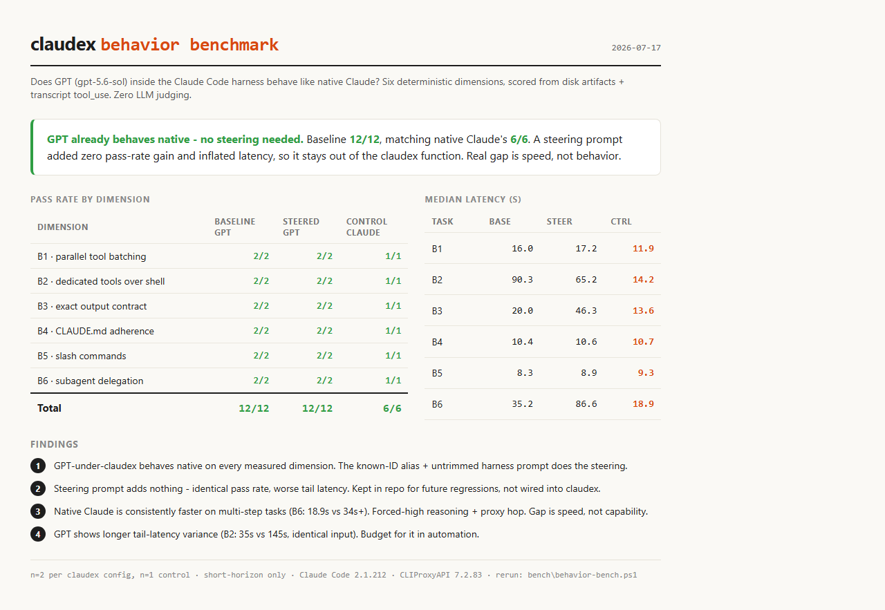

# claudex

Run OpenAI GPT models inside Claude Code on your ChatGPT/Codex subscription - with the FULL Claude Code harness: complete system prompt, tool schemas, skill descriptions, subagent orchestration, hooks, rules, and memory.

```powershell
claudex                    # safe low-friction mode: acceptEdits + Claudex policy
claudex -Auto              # explicit Claude Code auto-mode classifier
claudex -Yolo              # explicit --dangerously-skip-permissions bypass
claudex -p "do the thing"  # headless one-shot
```

On Linux, use `claudex --auto` and `claudex --yolo`. Auto and Yolo are mutually exclusive. The launcher fails closed if its Claudex settings file is missing or invalid.

## Why this exists (the model-ID trim problem)

Pointing Claude Code at a non-Anthropic model via `ANTHROPIC_BASE_URL` mostly works - but Claude Code silently degrades the harness for any model ID it does not recognize (exact internal-registry match; a `claude-` prefix is NOT enough):

Measured with `/context` through the same proxy, same upstream, **only the model ID varied**:

| Payload section | unknown ID (`gpt-5.6-sol`) | recognized ID (`claude-opus-4-8`) |
|---|---|---|
| **Skills** | **2.7k** - names only, descriptions stripped | **10k** - full descriptions |
| System prompt | 1.4k minimal stub | 1.6k full |
| Tool schemas | 5.9k sent up front - tool search is disabled for unrecognized IDs, so nothing can be deferred | deferred |
| MCP servers | 1.1k - loaded | 1.1k - loaded |
| Custom agents | 2.3k | 2.3k |
| Memory files | 3.9k | 3.9k |

Stripped skill descriptions are the killer: **73% of the skill payload disappears**, so the model sees skill names but cannot know when to invoke any of them.

Two things this measurement corrected, both previously asserted here without evidence: MCP servers are **not** dropped for unrecognized IDs, and tool schemas are not "compact" - an unrecognized ID actually sends *more* tool tokens up front, because deferred tool search is unavailable to it.

**The fix:** [CLIProxyAPI](https://github.com/router-for-me/CLIProxyAPI) runs as a local proxy authenticated to your ChatGPT account, and its `oauth-model-alias` exposes GPT upstreams under real Anthropic model IDs:

| Claude Code sees | Actual upstream | Role | Effort (P1) |
|---|---|---|---|
| `claude-opus-4-8` | `gpt-5.6-sol` | main session and Opus agents | maximum (launcher `--effort max`) |
| `claude-sonnet-5` | `gpt-5.6-terra` | auto-mode classifier and Sonnet agents | passthrough |
| `claude-haiku-4-5` | `gpt-5.3-codex-spark` | Haiku agents | upstream default |

Claude Code believes it is talking to Anthropic models and sends full prompts; the proxy routes to Codex. Sol, Terra, and Spark preserve the native expensive/medium/fast role split.

The proxy template ships performance profile P1 (selected after measurement): no wildcard effort override. Per-request effort passes through, so the Terra safety classifier and Spark subagents run at their own tier instead of being forced to max - the forced-max path caused a ~60s Terra classify that ended in `context canceled` and HTTP 500 on routine auto-mode checks. The flagship main session still reasons at max because the launcher passes `--effort max`. Profile choice and matched-run evidence: `BENCHMARKS.md`.

## Install (Windows)

Prereqs (the installer validates these):
- Windows PowerShell 5.1+ (stock Windows 11)
- Claude Code installed (`claude.exe` on PATH or `~\.local\bin`) - warned if missing, proxy still installs
- A ChatGPT plan with Codex access (for the OAuth login step)
- Port 8317 free (hard error if another app owns it)

```powershell
gh repo clone LeadGrowGTM/claudex   # private repo - use gh, or git clone with credentials
cd claudex
powershell -ExecutionPolicy Bypass -File install.ps1
```

The installer (idempotent, re-run any time to upgrade or repair):
1. Validates prereqs (PowerShell version, claude CLI, port 8317)
2. Downloads the pinned CLIProxyAPI release to `~\.cliproxyapi\`; `-NativeCompaction` also builds the exact experimental commit beside it
3. Generates a random local proxy key (`~\.cliproxyapi\.proxykey`)
4. Writes `cliproxyapi.conf` (model aliases, P1 effort passthrough) from the template; if a config already exists it is left alone, but the installer warns loudly when the model aliases are missing from it. An existing config that still carries the legacy P0 wildcard override is flagged by `doctor` with the exact non-secret migration
5. Validates and installs non-secret `claudex.settings.json`; a changed installed copy is backed up under a unique date-stamped `~\.cliproxyapi\archive\` directory before replacement
6. Registers a hidden autostart launcher in your Startup folder
7. Installs the `claudex` function into your PowerShell profile (marker-delimited block, replaced on re-run)
8. Starts the proxy and runs the interactive Codex OAuth login (browser)
9. Smoke-tests both model tiers end-to-end

Flags: `-Version <x.y.z>`, `-NativeCompaction`, `-StableProxy`, `-SkipLogin`, `-SkipAutostart`, `-SkipProfile`.

## Install (Linux / WSL2)

Same layout, same config, same pinned proxy version - a bash port of the above.

```bash
git clone https://github.com/LeadGrowGTM/claudex && cd claudex
./install.sh                 # add --systemd for a systemd --user unit
```

Flags: `--version <x.y.z>`, `--native-compaction`, `--stable-proxy`, `--skip-login`, `--skip-profile`, `--systemd`.

Differences from the Windows path:
- **Login uses the device-code flow** - prints a URL and a code, no browser or callback port needed. The `-codex-login` browser flow binds `:1455` and its `-oauth-callback-port` flag is broken (the redirect URI is hardcoded), so device login is the default here. To re-run it by hand, `-config` is **required** - the binary otherwise defaults to `$(pwd)/config.yaml` and dies before login:
  ```bash
  ~/.cliproxyapi/cli-proxy-api -config ~/.cliproxyapi/cliproxyapi.conf -codex-device-login
  ```
- **No autostart by default.** The `claudex` function starts the proxy on demand; `--systemd` writes a user unit instead. On WSL2 that needs `[boot] systemd=true` in `/etc/wsl.conf` plus `loginctl enable-linger $USER`, or the unit dies at logout.
- **The function is sourced, not inlined** into `~/.bashrc`, so re-running the installer upgrades it without rewriting your rc file.

**Do not run a Windows proxy and a Linux proxy against the same auth dir.** Credentials are portable plain JSON, but refresh tokens rotate: the second instance to refresh gets `refresh_token_reused`, which CLIProxyAPI treats as non-retryable and marks the auth unavailable. There is no cross-process locking and the credential write is a non-atomic in-place truncate. One machine, one login. (`doctor.sh` warns if it spots a Windows-side credential.)

Under WSL2 with `networkingMode=mirrored`, a Windows-side proxy on `127.0.0.1:8317` *is* reachable from WSL - so you can point a WSL `claudex` at a Windows proxy instead of installing a second one. That keeps one credential, at the cost of depending on an `[experimental]` `.wslconfig` setting.

## Permission modes and safety boundary

Default `claudex` uses `acceptEdits` with a Claudex-only settings file, applied with `--settings`. That flag *merges* the Claudex policy as a union over your ambient `~/.claude` settings - it does not replace them - and precedence is deny > ask > allow. So the Claudex `deny` and `ask` rules bind no matter what ambient allows (destructive, publication, and deploy actions stay gated), but the Claudex `allow` list cannot *narrow* an already-broad ambient `allow`: a general command your ambient settings already allow still runs. This avoids a separate Terra safety-classifier request for routine local work while keeping explicit policy boundaries:

- Dedicated file tools, narrow PowerShell inspection, read-only Git/GitHub commands, and common test runners are allowed.
- Conventional deletion and truncation commands, destructive Git operations, force flags, and cross-shell escapes are denied.
- Push, PR writes, issue writes, release actions, package publication, and deploy commands ask for human approval.
- `Agent` is statically allowed in the default mode. Parent `acceptEdits` policy remains authoritative inside every child, so subagent frontmatter cannot raise permissions.
- Eight Codex CLI port skills are `user-invocable-only`. They remain available by name but cannot auto-load false guidance such as "subagents do not exist" into a Claudex session.

`claudex -Auto` or `claudex --auto` opts into Claude Code auto mode. Claudex restores auto mode's default allow and environment sets, but remaining actions still need the Sonnet classifier. This mode costs an extra model request and can fail when Terra is unavailable. `-Yolo` or `--yolo` remains an explicit bypass and is never the default.

The settings file stores policy only. It contains no proxy key, OAuth token, API key, or credential path.

## Experimental OpenAI server compaction

Normal claudex uses Claude Code's local compaction request. CLIProxyAPI's released Claude-to-Codex translator does not bridge that request to OpenAI's `/responses/compact` endpoint. Upstream [PR #4465](https://github.com/router-for-me/CLIProxyAPI/pull/4465) adds the missing bridge, but it remains a draft with merge conflicts and has no released binary. It is therefore opt-in, never the default.

The opt-in build fetches the PR author's [`Johnnybyzhang/CLIProxyAPI`](https://github.com/Johnnybyzhang/CLIProxyAPI) fork and pins its [signed head commit](https://github.com/Johnnybyzhang/CLIProxyAPI/commit/725aa9f1bd61c76edb315ae80c7be6215198621a), `725aa9f1bd61c76edb315ae80c7be6215198621a`. Installers fetch that exact commit, require a clean checkout, require Go 1.26+, build it locally, and keep the official release beside it as the rollback path:

```powershell
powershell -ExecutionPolicy Bypass -File install.ps1 -NativeCompaction
# Return to the official release without deleting source or binaries:
powershell -ExecutionPolicy Bypass -File install.ps1 -StableProxy
```

```bash
./install.sh --native-compaction
# Return to the official release without deleting source or binaries:
./install.sh --stable-proxy
```

Activation uses `~/.cliproxyapi/.native-compaction-enabled`, which contains only the pinned commit SHA. Switching back archives that marker and retains the fork checkout and built binary. The launcher refuses to use a running process from the wrong channel, so restart the proxy after changing channels.

When active, a Claude Code compaction turn sends the retained transcript and compaction instruction to OpenAI `/responses/compact`. The bridge wraps OpenAI's opaque compacted item in a strict Claude-compatible capsule, stores that capsule in the normal local Claude transcript, and binds replay to the Codex credential that created it. Treat the feature as experimental: the patch is large, unmerged, and may change before upstream release. The existing 200k window and 25k MCP-result cap remain in force.

### Choosing a channel

The two features are independent and both survive on this build. The **P1 effort profile** (passthrough effort with a `--effort max` launcher for the flagship tier) is always on - it is the default runtime and needs no opt-in. The **OpenAI server-compaction channel** is the separate opt-in above (`-NativeCompaction` / `--native-compaction`), which swaps the released router-for-me proxy for the pinned Johnnybyzhang fork. Run the stable P1 build for everyday work; enable server compaction only when you specifically want OpenAI-side `/responses/compact` instead of Claude Code's local compaction, and return to stable (`-StableProxy` / `--stable-proxy`) when done.

## Health check

```powershell
powershell -ExecutionPolicy Bypass -File doctor.ps1          # read-only chain check
powershell -ExecutionPolicy Bypass -File doctor.ps1 -Smoke   # + live calls through both tiers
```

```bash
./doctor.sh            # read-only chain check
./doctor.sh --smoke    # + live calls through both tiers
```

Checks every link: Claude CLI, the selected proxy channel (stable router-for-me release or the pinned native-compaction fork), native source pin and cleanliness when that channel is active, proxy binary/key/config, all model aliases, Claudex settings JSON and key policy rules, installed launcher mode, legacy wildcard effort override, running binary/channel match, proxy process and port 8317 ownership, live `/v1/models`, Codex credential, context-window pin, environment leakage, and recent proxy 500/502/503, `auth_unavailable`, and `context canceled` metadata. Request bodies are skipped. Exits nonzero on any failed health check - first thing to run when claudex misbehaves.

## Tests

Run the offline native-compaction contract first. It does not start a proxy, read credentials, call the network, run an installer, or build Go source:

```powershell
powershell -ExecutionPolicy Bypass -File test\test-native-compaction-contract.ps1
```

It checks the exact commit and source remote across both platforms, stable-by-default activation, non-destructive rollback, interrupted-checkout recovery, Go version floors, launcher and doctor guards, documentation, and PowerShell and bash syntax.

Then run the harness tests when Claude Code, the proxy, or model config changes:

```powershell
powershell -ExecutionPolicy Bypass -File test\test-performance-policy-contract.ps1
powershell -ExecutionPolicy Bypass -File test\test-orchestration.ps1
```

The policy contract is offline. It checks settings structure, safety rules, launcher modes, installer backup order, benchmark safeguards, and effort-profile recognition without calling a model.

The orchestration test is live and intentionally forces three parallel Agent calls. It proves Agent availability, fresh child transcripts, aggregation, and Haiku/Spark routing. It does not prove that a model chooses delegation on its own.

## Behavior and performance benchmarks

The 2026-07-17 behavior suite passed **12/12 Claudex checks and 6/6 native checks** across tool batching, tool choice, exact outputs, workspace rules, slash commands, and forced Agent availability. Its B6 prompt explicitly requires Agent, so that result cannot support an organic-delegation parity claim. A broad steering prompt added no pass-rate gain and remains unwired.

`bench\performance-parity.ps1` adds outcome-only organic delegation, routine permission handling, explicit auto-classifier latency, and custom-agent model routing. Dry mode is the default and spends no quota:

```powershell
powershell -ExecutionPolicy Bypass -File bench\performance-parity.ps1
powershell -ExecutionPolicy Bypass -File bench\performance-parity.ps1 -Live -Variants claudex-policy,native-policy -Scenarios routine,organic,routing -Reps 3 -Profile P1
```

For controlled P1/P2 tests, `bench\set-effort-profile.ps1 -Profile P1` removes only the canonical wildcard override. It writes a date-stamped backup containing the old public effort block and full-config hash, never a copy of the key-bearing config. `-Profile P0` restores the canonical block. Restart CLIProxyAPI normally after a change.

A live run must be requested with `-Live`. Matched P0 and P1 runs are recorded: P1 is the selected profile (no latency penalty versus P0, faster classifier, no forced-max Terra cancellation), and Claudex organically delegated the three-module task in 3/3 runs while native did it inline - so Claudex does not trail native on delegation. P2 was not needed. A heavier six-module fixture (`organic6`) confirmed native's non-delegation is scale-independent, so the symmetric "delegates exactly like native" claim is dropped rather than pursued further. Full results, method, and caveats: `BENCHMARKS.md`.



## Native tools and the system prompt under claudex

The known-ID alias is only half the story - the proxy still has to forward what Claude Code sends, and it does. CLIProxyAPI's Claude-to-Codex request translator (`internal/translator/codex/claude/codex_claude_request.go`) maps Claude's `system` prompt into a `developer` message inside the Codex `input[]` array (the `system` -> `role:"developer"` conversion), forwards the full `tools` array unchanged, and leaves the top-level `instructions` field empty - no Codex system prompt overrides Claude's. `tool_reference` blocks survive too: verified live, a claudex session loaded a deferred tool schema via `ToolSearch` and completed the call. So any recognition gap is behavioral (the model not reaching for a tool), not a forwarding drop.

Per tool, on the GPT path:

| Tool | Status |
|---|---|
| `Agent` | verified used |
| `Skill` | verified used |
| `ToolSearch` (deferred schema load) | verified used |
| `TaskCreate` / `TaskUpdate` | verified used |
| `Read` / `Write` / `Edit` / `Bash` / `PowerShell` | verified used |
| `AskUserQuestion` | interactive-only - headless `-p` reports "not enabled in this context", identical to stock claude |
| `Task` / `TodoWrite` | superseded by `Agent` / `TaskCreate` - not used, expected |

### MCP and Nexus on the GPT path

Local MCP tools and the Nexus knowledge graph are reachable and return real data under claudex - proven live: a claudex session loaded the deferred `nexus_search` schema and got real graph hits (25 of them). But GPT under claudex does not invoke MCP tools *organically* (0 of 81 past sessions reached for one unprompted). Workaround: name the MCP tool explicitly in the prompt, or force it through a skill that calls it.

## How it fits together

```
claudex (PowerShell fn)                 sets ANTHROPIC_BASE_URL=127.0.0.1:8317 + aliased model IDs
  -> claude.exe --model claude-opus-4-8    full harness: skills, hooks, rules, memory, subagents
    -> CLIProxyAPI (local, port 8317)      oauth-model-alias: opus-4-8 -> sol, haiku-4-5 -> spark
      -> chatgpt.com Codex backend          your ChatGPT subscription, no API key billing
```

Your normal `claude` command is untouched - claudex sets env vars only inside its own invocation and restores them afterwards.

## Design decisions / gotchas

- **`CLAUDE_CODE_SUBAGENT_MODEL` must stay unset.** It overrides per-agent model frontmatter and forces every subagent onto the flagship tier (found via the orchestration test).
- **Alias must be an exact known Anthropic ID.** `claude-gpt-5.6-sol` still gets the trimmed harness; the registry check is exact-match.
- **Subagent model IDs must resolve, too.** Every agent's frontmatter `model:` has to hit one of the three aliases (`claude-opus-4-8` / `claude-sonnet-5` / `claude-haiku-4-5`) or a bare tier name backed by the `ANTHROPIC_DEFAULT_{HAIKU,SONNET}_MODEL` launcher pins. A dated or variant ID (e.g. `claude-sonnet-4-6`, `claude-haiku-4-5-20251001`) needs its own `oauth-model-alias` entry, or the spawn 502s "unknown provider". `doctor` now warns on any unmapped agent model.
- **The context window is pinned to 200k by the claudex function, and this is load-bearing.** `_CLAUDE_CODE_ASSUME_FIRST_PARTY_BASE_URL=1` (needed so Claude Code treats the proxy as first-party) also satisfies Claude Code's native-1M gate: `TM()` returns `1e6` when the model is `native_1m` and `provider==="firstParty" && Nd()`, and `Nd()` returns true for exactly that env var. Both `claude-opus-4-8` and `claude-sonnet-5` are `native_1m`, so an unpinned claudex session gets a **1,000,000-token budget against a ~258k upstream ceiling** (272k catalog x 0.95 effective) and overflows instead of compacting. `CLAUDE_CODE_AUTO_COMPACT_WINDOW=200000` moves the trigger below the real ceiling. Verified live via `/context`: unset -> `1m`; `AUTO_COMPACT_WINDOW=250000` -> `250k`; `CLAUDE_CODE_MAX_CONTEXT_TOKENS=272000` alone -> `1m` (ignored - `aNc()` gates it to model IDs that do *not* start with `claude-`); `DISABLE_COMPACT=1` + `MAX_CONTEXT_TOKENS=272000` -> `272k`, but that also removes `/compact` entirely. 200k (not 240k) leaves a ~58k buffer: Claude Code counts the window with the Anthropic tokenizer, but upstream GPT-5.6-sol counts the same payload 5-12% higher, so a thinner buffer let the compaction request itself land over the ceiling and fail to recover. `doctor.ps1`/`doctor.sh` assert the pinned value is `<=210000`, not just present. `MAX_MCP_OUTPUT_TOKENS=25000` is also set, capping any single MCP result so one large tool response can't spike a request past the ceiling between compact checks. `claudex.settings.json` also pins `autoCompactWindow: 200000` as a durable backup: Claude Code 2.1.219+ resolves the auto-compact window from `CLAUDE_CODE_AUTO_COMPACT_WINDOW` first and then from that settings field (`window = min(nativeMax, configured)`), so the trigger stays at ~167k (window minus a ~33k buffer) even if the env var ever fails to propagate.
- **The fast tier is still oversized.** `claude-haiku-4-5` is not `native_1m`, so it gets Claude Code's 200k default - against `gpt-5.3-codex-spark`'s real 128k. `CLAUDE_CODE_AUTO_COMPACT_WINDOW` is global, so it can't fix one tier without lowering all of them. Keep haiku-tier subagent work short.
- **Deferred tool search runs under claudex, and that's fine - leave `ENABLE_TOOL_SEARCH` unset.** Claude Code disables it for non-first-party hosts (*"Set ENABLE_TOOL_SEARCH=true if your proxy forwards tool_reference blocks"*), but that check is `vn()==="firstParty" && !Nd()`, which the assume-first-party flag defeats - so tool search stays on. Verified working end to end: `/context` reports tools as deferred, and a prompt requiring the deferred `WebFetch` tool caused GPT to load the schema via ToolSearch and complete the fetch. CLIProxyAPI does forward `tool_reference` blocks. Setting `ENABLE_TOOL_SEARCH=false` would switch to `standard` mode and send every schema up front - about 5k extra tokens per session on this loadout, for no gain.
- **Vision works.** Verified: a claudex session read a PNG off disk and returned its contents correctly. Upstream CLIProxyAPI #2931 (Claude URL images not preserved) does not affect local file reads.
- **Cache-write tokens are invisible, so cost readouts are a floor.** CLIProxyAPI's Codex->Claude translator never sets `cache_creation_input_tokens` (the sibling Codex->OpenAI translator does map it), and cache writes bill at 1.25x uncached input. The statusline `wk $` and `ccusage` structurally under-report claudex spend.
- **claude.ai connectors and cloud features don't work under claudex** (Clay/Google connectors, the `schedule` skill): any `ANTHROPIC_AUTH_TOKEN` disables claude.ai-account features. Local MCP servers (stdio/http with keys) work fine.
- **Remote Control cannot work inside a claudex session** - by design, not a bug. Three independent blockers per the official docs (https://code.claude.com/docs/en/remote-control.md): (1) since Claude Code v2.1.196 Remote Control is disabled whenever `ANTHROPIC_BASE_URL` points anywhere other than `api.anthropic.com`; (2) it requires claude.ai subscription OAuth, and `ANTHROPIC_AUTH_TOKEN` takes auth precedence over the OAuth login; (3) Remote Control traffic registers and polls through the Anthropic API itself, so it cannot be split off from proxied model traffic. Plain `claude` sessions are unaffected - the claudex function scopes its env vars and restores them on exit.
- **Slash commands and skills work normally under claudex** (that is the whole point of the known-ID alias). Verified headless: project `.claude/commands` expand and execute, and plugin skills invoke, under the proxy env.
- **Native harness tools work normally under claudex** - the toolset comes from Claude Code, not the model, and the known-ID alias keeps it untrimmed. Verified: Agent/Skill/Read/Write/Grep plus MCP tools all invoke under the proxy env. `AskUserQuestion` is interactive-only: headless `-p` reports "exists but is not enabled in this context" *identically* on stock claude - mode gating, not a claudex limitation.
- **The proxy key is a local-loopback-only self-generated secret**, not a cloud credential. The Codex OAuth credential lives in `~\.cli-proxy-api\` (created by the login flow).
- **Model identity:** inside claudex, `/context` and self-reports say "Opus 4.8" - it is GPT underneath. The alias is a routing disguise, not a lie you should forget.

## Optional: claudex-aware statusline

```powershell
powershell -ExecutionPolicy Bypass -File statusline\install-statusline.ps1
```

Replaces (with backup) your Claude Code statusline with one that renders:

```
Opus 4.8 claudex:GPT-5.6-sol | repo | branch* | [███░░░░░░░] 34% (69k) | A:5h[█████]94% wk[███░░]59% | X:wk[█████]91% spk[█████]98% | th:high | wk $10.04
```

- magenta `claudex:GPT-...` marker whenever the session runs through the proxy (detected via inherited `ANTHROPIC_BASE_URL`) - the model name says Opus/Haiku, the marker tells the truth
- `A:` Anthropic budget LEFT (5h session + week) as 5-cell bars, live from Claude Code's rate-limit feed
- `X:` Codex budget LEFT (week + spark meter) from ChatGPT's usage API, cached 30 min, refreshed in the background via the proxy's OAuth credential
- `th:` thinking/effort level; context bar uses Claude Code's exact window numbers
- `wk $` estimated week spend via `ccusage` (optional; note claudex sessions inflate it at Opus rates - read as Opus-equivalent burn, not invoice)

### Linux statusline

`install.sh` drops a claudex-aware statusline at `~/.cliproxyapi/statusline.sh` but does **not** wire it up. To use it, point `~/.claude/settings.json` at it (back the file up first):

```json
"statusLine": { "type": "command", "command": "/home/you/.cliproxyapi/statusline.sh" }
```

It is a superset of a plain statusline - identical output for normal sessions - and adds a marker naming the real upstream when the session runs through the proxy, resolved by reverse-mapping `model.id` through `cliproxyapi.conf`:

```
Opus 4.8 claudex:gpt-5.6-sol | ~$1.23 | Context: 8% | +5/-2 lines | Wk: 59%
```

The `~$` is deliberate: that figure is a floor, priced at Anthropic rates and missing cache-write tokens the translator drops. Without this marker a claudex session and a real Opus session look identical, which matters once you run both.

## Uninstall

```powershell
powershell -ExecutionPolicy Bypass -File uninstall.ps1
```

Stops the proxy, removes autostart + the profile function. Binaries, config, keys, and OAuth credentials are left in place (paths printed) for manual removal.

## Troubleshooting

Run `doctor.ps1` first - it pinpoints the broken link. Common fixes:

- `502 unknown provider for model claude-opus-4-8` - the alias block is missing from `~\.cliproxyapi\cliproxyapi.conf`. Back up the current config, merge the `oauth-model-alias` block from `config\cliproxyapi.conf.template`, then restart normally.
- `claudex: settings not found` or invalid settings JSON - re-run the installer. It backs up a changed non-secret settings file before replacement.
- `auto mode cannot determine action safety` - Terra classifier failed. Use default `claudex` for policy-controlled local work; reserve `-Auto` for explicit classifier testing or higher scrutiny.
- Proxy not running - `claudex` auto-starts it; manually: `~\.cliproxyapi\start-hidden.vbs` or check `tasklist | findstr cli-proxy-api`.
- Login expired - `~\.cliproxyapi\cli-proxy-api.exe -codex-login`.
- Config changed but behavior did not - stop the proxy normally with `Get-Process cli-proxy-api | Stop-Process`, then run `claudex` to auto-start it.

## Repo layout

```
install.ps1 / install.sh                    one-command setup (idempotent) - Windows / Linux
doctor.ps1  / doctor.sh                     read-only health check (-Smoke / --smoke for live calls)
uninstall.ps1                               removes autostart + profile fn, keeps credentials
profile/claudex-function.ps1                Windows launcher source
profile/claudex-function.sh                 bash/zsh launcher source - keep modes in sync
config/cliproxyapi.conf.template            proxy aliases and current effort profile
config/claudex.settings.json                non-secret Claudex safety and skill-routing policy
test/test-performance-policy-contract.ps1   offline policy/install/launcher contract
test/test-native-compaction-contract.ps1    offline server-compaction channel and syntax contract
test/test-orchestration.ps1                 live forced-Agent availability regression
bench/performance-parity.ps1                routine, classifier, organic, and routing benchmark
bench/set-effort-profile.ps1                non-secret P0/P1/P2 proxy effort switcher
statusline/install-statusline.ps1           optional claudex-aware statusline (usage bars, GPT marker)
statusline/statusline.ps1                   statusline renderer + background usage refreshers
statusline/statusline.sh                    bash statusline with Claudex upstream marker
```
